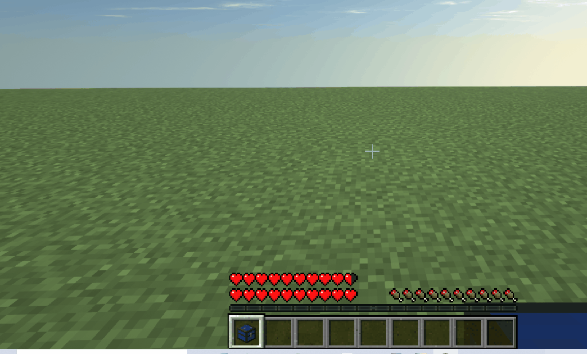

# 玩家宝石

* **准备工作**：
  * 打开GUI获取一颗一次性宝石
  * 通过你喜欢的方式把宝石发放给玩家

### 右键使用的宝石

* 以常用的【随机点券兑换券】为例，玩家手持宝石，直接右键使用

### 食用的宝石

* 以内置的【龙胆】为例，玩家手持宝石，食用获得奖励


* 不仅药水，食物、牛奶桶都可以做成可食用的宝石
* MC版本1.11以上颜色可任意自定义，MC版本1.9-1.10也有18种颜色可选



[freegem.md](../freegem.md)


