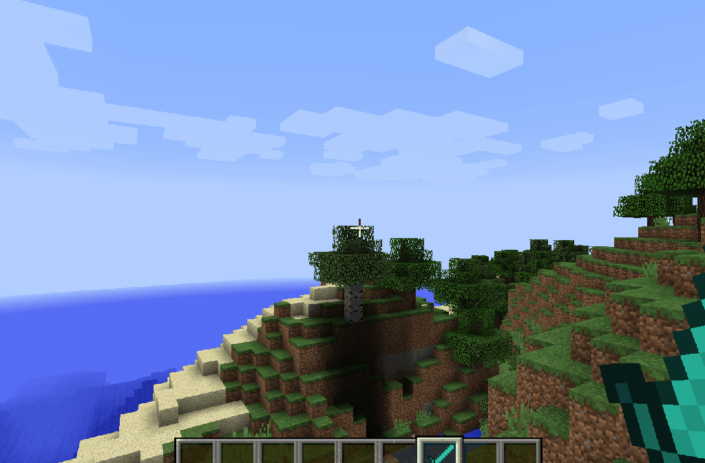

# 功能演示

## 基本功能

### 附魔宝石

* 附魔宝石，超越原版上限，同时支持EcoEnchants/GoldenEnchants等
* 限制、概率随心配置，动态读写
* 内置宝石已经囊括所有原版附魔，拿来即用

.png>)

### 药水宝石

* 通过Lore触发技能引擎技能：药水Buff（宝石内置技能之一）
* Lore样式可修改，简单改写即可支持罗马数字
* 支持世界统一限制和每种药水单独的世界限制
* 性能极致优化，不卡服

.png>)

### 属性宝石

* **因为作者效(you)率(dian)高(lan)，这里演示的槽位比较丑**
* 但实际上槽位样式文字都可以自定义，取决于您的设计
* 例如单行多槽宝石

.png>)

* 一行一槽宝石
  * **再次提醒，槽位样式可自定义**

.png>)

* 结合您想要的文字和符号，可以展现更丰富的效果。如

.png>)

### 玩家宝石

* 兑换券

.png>)

* 礼包

.png>)

* 食用品

.png>)

### 内置技能

* 切换技能（可随意切换装备描述、附魔、属性、技能组）

.png>)

* 计数技能
  * 触发器的触发次数满足一定条件，则触发技能

.png>)

* DEBUFF
  * 定身、缴械、禁疗……

.png>)

* 持续技能、比例吸血技能
  * 持续时间内技能组无冷却
  * 吸血技能可以从近战/远程攻击、技能攻击、受伤当中吸血

.png>)

* 闪现技能
  * 该技能不仅可以右键闪现，还可瞬移到弓箭落地的位置等

* MM技能
  * 依靠Lore识别并触发一切MM技能
  * 可自定义冷却时间提示的样式和位置
  * 可以与内置技能混写

.png>)

## 进阶使用

### 装备升级

* 精确修改装备描述、属性、技能，不影响玩家对装备的已有强化
* 可以拆卸降级

.png>)

### 符文镶嵌

* 特殊的镶嵌台GUI
* 每个格子都只能镶嵌某种类型的宝石

.png>)

### 符文合成

* 不仅可以合成宝石，还能合成原版/MM物品
* 点击按钮可在镶嵌台之间跳转
* 点击按钮等价于使用宝石，因此可使用一切宝石奖励，当作菜单使用
* 因此，你可以自行制作强化台

.png>)

### 符文分解

* 可以根据投入的装备执行奖励
* 因此，它可以分解一切宝石、物品、装备，并给玩家任何宝石支持的奖励

.png>)

## 更多功能

* 插件功能高度自定义，远多于上述展示内容
* 请根据WIKI编写你想要的功能
