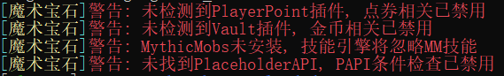

# 安装

### 开始

* 爱发电支付和作者处购买均会附带一份Jar文件
* 如果您没收到，可以**点击下方链接**下载插件





* 将插件放入服务器plugins文件夹
* 重启服务器，或使用任意插件管理工具的指令热加载
  * 例如：>plugman load magicgem
* 若验证失败插件功能将禁用，请在完成网站绑定后使用/mgem reload

<!---->

* 将插件放入服务器plugins文件夹
* 重启服务器，或使用任意插件管理工具的指令热加载
  * 例如：>plugman load magicgem
* 若验证失败插件功能将禁用，请在完成网站绑定后使用/mgem reload


* 本插件可安全热加载、热重载，所有已经打开的GUI会自动关闭，并返还未取出的玩家物品
* 但是每次热重载均会触发网络验证，且验证冷却时间指数上升
* 如果您反复热重载插件导致每日验证次数过多，**可能导致IP自动封禁**


* 请尽可能使用**/mgem reload**重载。这个指令可以显示大部分的验证/配置问题

### 填写绑定用户

* 安装插件，在生成的配置文件夹（MagicGem）下找到config.yml
* 打开并在user: 处填写你的用户名


**注意：user的冒号后面要加空格**！


```
#====================
# MagicGem v1.05 正式版
# 使用说明详见WIKI
#
# 插件验证管理系统
#   42.192.128.205
#====================
lang: zh_CN
# 若无通知, 请不要更改此处IP地址
license-ip:
 - 42.192.128.205:2021
# 在user处填写您的注册用户名. 注意冒号后面有空格！
user: Test001
# 全局设置
# 工作台使用宝石开关
workbench: true
# 背包使用宝石开关
backpack: true
# 宝石Lore识别开关
gem-lore: false
# 是否允许将宝石用作原版合成材料（不推荐修改）
gem-craft: false
# 技能引擎开关
skill-engine: true
# 药水引擎全局设置
potion-global-limit:
  example-world: 5
```

* 然后/mgem reload即可成功验证
* 在高版本服务器（1.16+）上所有附魔、药水都能正常加载，此时加载情况如下

.png>)

### 前置警告

* 在连接到验证服务器之前插件会首先提醒您缺失的前置。
* 缺少重要前置会导致相应功能没有效果（比如，没有PlayerPoints会使得点券收费无效）



### 网络验证

* 如果您在上一步正确完成了绑定，插件将直接提示成功认证，并立即开始加载
* 如果您没有正确绑定，插件将提示您正确的IP地址和端口号**，**请参考【绑定】一节正确绑定

.png>)


* 插件加载为全异步执行，验证服务器卡顿、配置文件错误均不会导致您服务器运转的卡顿
* 验证成功后，您服务器的网络中断不会引起插件功能失效，也不会影响玩家游戏体验
* 国内MC圈倒卖现象严重。您的购买是我的荣幸，验证带来不便，还请您体恤我的辛苦劳动


### 配置文件读取

* 成功认证后插件将释放内置的资源文件并读取
* 由于您服务器的前置安装不同，配置读取失败是**正常现象**
  * **缺少依赖的宝石奖励，不会提示也不会生效**
  * 如下图，点券、金币、MythicMobs、MMOItems、PAPI均未安装，它们的相关奖励会全部失效
* 由于Minecraft版本不同，有些内置宝石会无法读取，例如如1.13以下没有激流附魔，含有这一奖励的宝石就会读取失败并发出警告，提示在哪一行出错
  * 下图展示了在Spigot1.9无插件情况下的加载情况。这是**正常现象**

.png>)

* 这些警告不影响插件正常工作
* 如果您觉得红色警告不舒服，把宝石配置里对应的宝石删掉即可
* **不要直接删除**配置文件，否则它们会重新生成，但您可以清空对应的配置文件内容

**至此，插件安装全部完成**


[Broken link](broken-reference)

